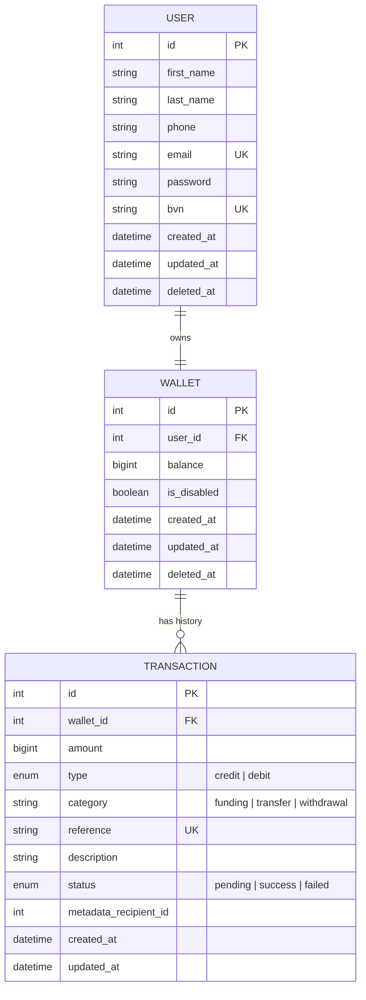

# Demo Credit Wallet Service MVP

A robust, secure, and scalable wallet service built to power the "Demo Credit" mobile lending application. This service facilitates core financial operations including user account management, wallet funding, peer-to-peer transfers, and withdrawals.

## Database Schema (E-R Diagram)

The following diagram illustrates the relationship between users, their wallets, and the transaction history.



## Features

- **User Authentication**: Secure signup and login with JWT-based authorization.
- **Lendsqr Karma Check**: Proactive blacklist verification during signup using the Adjutor API to prevent fraudulent accounts.
- **Wallet Management**:
    - **Funding**: Securely add funds to a wallet (simulated partner validation).
    - **Transfers**: Seamless peer-to-peer fund transfers between users.
    - **Withdrawals**: Securely move funds out of the wallet.
- **Atomic Transactions**: All financial operations use database transactions to ensure data integrity and prevent race conditions.
- **Audit Trail**: Comprehensive transaction logging for every credit and debit operation.

## Tech Stack

- **Runtime**: [Node.js](https://nodejs.org/)
- **Language**: [TypeScript](https://www.typescriptlang.org/)
- **Database**: [MySQL](https://www.mysql.com/)
- **Query Builder**: [Knex.js](https://knexjs.org/)
- **Authentication**: [JWT (JSON Web Tokens)](https://jwt.io/)
- **Validation**: [Zod](https://zod.dev/)
- **Security**: [bcrypt](https://github.com/kelektiv/node.bcrypt.js) for password hashing.

## Getting Started

### Prerequisites

- Node.js (v18+)
- MySQL Server

### Installation

1.  **Clone the repository**:
    ```bash
    git clone <repository-url>
    cd demoCredit
    ```

2.  **Install dependencies**:
    ```bash
    npm install
    ```

3.  **Environment Setup**:
    Create a `.env` file in the root directory based on the project requirements.
    ```env
    DB_HOST=localhost
    DB_USER=your_user
    DB_PASSWORD=your_password
    DB_NAME=demo_credit
    APP_SECRET=your_jwt_secret
    ```

4.  **Database Migrations**:
    Run the migrations to set up the database schema.
    ```bash
    npm run migrate:latest
    ```

## Development Scripts

- `npm run dev`: Start the development server with hot-reload (using `ts-node`).
- `npm run build`: Compile TypeScript code to JavaScript.
- `npm start`: Run the production build.
- `npm run migrate:make`: Create a new migration file.
- `npm run migrate:latest`: Apply all pending migrations.
- `npm run migrate:rollback`: Roll back the last migration batch.

## Project Structure

```text
src/
├── controllers/    # Request handlers and route logic
├── services/       # Core business logic (Auth, Wallet, Users)
├── database/       # Database connection and migrations
├── jwt/           # JWT utilities and authentication guards
├── schemas/        # Zod validation schemas
├── utils/          # Helper functions and routing map
└── index.ts        # Application entry point
```
